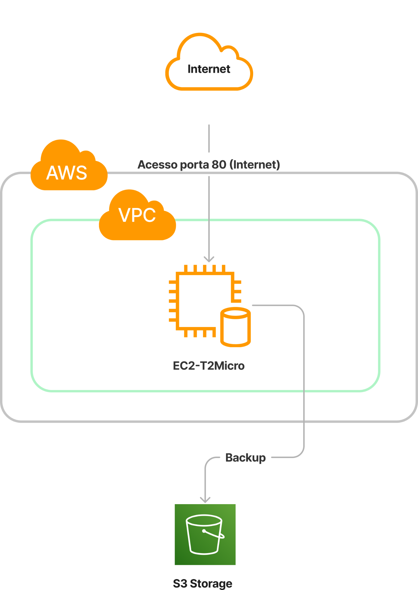

<div align='center'>
 

 
 </div>

# Teste para vaga de DevOps no Magazord.com.br
Este repositório tem como fim testar os candidatos para vaga de devOps na empresa [Magazord](https://magazord.com.br).
> Para esta vaga buscamos alguém apaixonado por tecnologia e esteja sempre atento aos detalhes!


## O teste

As questões aqui apresentadas visam avaliar o nível de conhecimento do candidato. Leia com atenção as recomendações abaixo:

> [!NOTE]
> O candidato deve ter acesso à uma conta AWS para conseguir responder às questões.

 > [!IMPORTANT]
 > **É possível criar uma conta AWS usando email pessoal e usar os recursos demandados pela avaliação, sem custos;**

> [!NOTE]
> A solução proposta deve atender minimamente ao enunciado da questão. Fica a critério do candidato a complementação da questão com soluções alternativas ou uso de ferramentas e procedimentos adicionais;
> Todos os scripts desenvolvidos devem ter cada etapa documentada;

> [!NOTE]
> Após finalizado, os códigos/documentos gerados devem ser disponibilizados em repositório GitHub para download.
> Para correta validação das atividades, lembre-se de expor publicamente as portas necessárias e fornecer as credenciais para acesso à instância criada.

Com base no cenário abaixo apresentado, elabore soluções e respostas para as questões apresentadas após a imagem.



## Questões:

  1. Crie a estrutura proposta (imagem anterior) na AWS usando Infraestrutura como Código (IaC) com Terraform, na região us-east-1:
     - Virtual Private Cloud (VPC);
       - Ec2 Instance (t2.micro se enquadra em free tier);
         - Docker
         - PostgreSQL 13
  2. Publique na instância EC2 criada anteriormente, uma página PHP qualquer em container (ex. Hello World), utilizando imagem PHP + Apache no Docker;
  3. Ainda na instância EC2, configure o serviço de banco de dados PostgreSQL instalado anteriormente para responder apenas às requisições da máquina local.
  4. Aplique o script abaixo para criação de um banco de dados que será usado como base para a próxima atividade:
      ```
     CREATE DATABASE testdb;
     CREATE TABLE table1 (
      column1 integer,
      column2 integer);
     
     INSERT INTO table1 (column1)
     SELECT a.column1 FROM generate_series(1, 1000000) AS a (column1);
     ```
  5. Crie um script Python para geração de backup do banco de dados PostgreSQL e posterior armazenamento em um bucket do S3.
  6. Configure um servidor Jenkins (pode ser container local ou na instância criada na etapa 1), e construa uma pipeline que busque do S3 um arquivo PHP e publique no container Apache construído anteriormente (o uso de AWS ECS é um diferencial).
  7. Disponibilize um repositório do Git os seguintes arquivos:
     - Arquivo(s) terraform utilizados para a criação da Infraestrutura;
     - Script python criado para backup da base de dados;
     - Dockerfiles utilizados;
     - Documentação dos passos executados durante a realização das questões;
     - Arquivo XML do projeto criado no Jenkins.

## Envio do teste

* Suba o repositório no seu Github e envie o link diretamente para o seu recrutador.
Obs.: Não serão aceitos alterações após o envio.